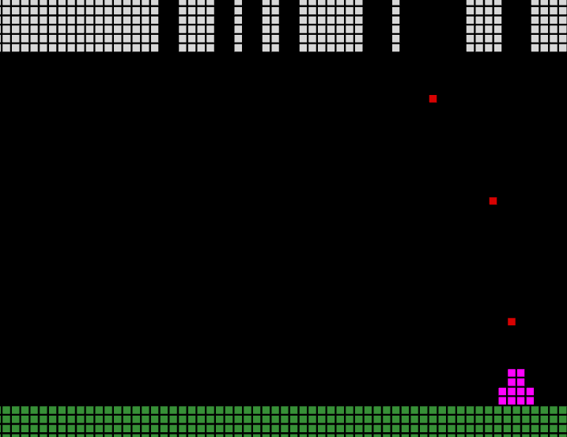

# MineBlast

A 2D look game in a 3D world with three.js.



## Goals

- Get a finished game running with threeJS
- Employ shaders for special effects
- Experiment with easing and realistic motion
- Experiment with pseudo-physics -> _kaboom_, flying particles

## Dev Setup

```bash
# npm i -g eslint vite
npm i
```
