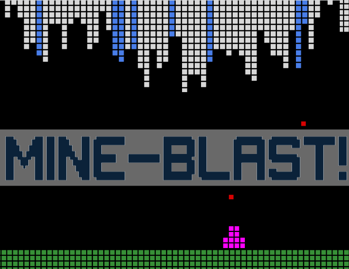

# MineBlast

A 2D look game in a 3D world with three.js.

Try it out at [cawoodm.github.io/mineblast](https://cawoodm.github.io/mineblast/)!



## Concept

Technically, you are in world of "bloxels" which is like a 2d voxel or... a large pixel.  
Technically, you are made of bloxels.  
Technically, you can shoot bloxels at other bloxels and watch things go kablooie with real physics!

Narratively, you are an intrepid miner craft in a strange world tasked with mining Bloxonium.  
Aim your cannon at the surface of the caves you explore to gently dislodge Bloxonium and harvest it without damaging the precious crystal.
Gain upgrades to your cannon and find clever and efficient ways of mining whilst avoiding Danger.

## Goals

- Get a finished game running with threeJS
- Employ shaders for special effects
- Experiment with easing and realistic motion
- Experiment with pseudo-physics -> _kaboom_, flying particles

## TODOs:

- Rotate cannon
- Falling crystals
- Space cavern pixelart background
- Side-scrolling?
- Enemies?

## Done

- Shoot pew pew sound
- Cannon recoil
- Music
- Screen shake

## Dev Setup

```bash
# npm i -g eslint vite
npm i
vite
```

To view from internet/device:

```bash
ngrok http 5173
```
